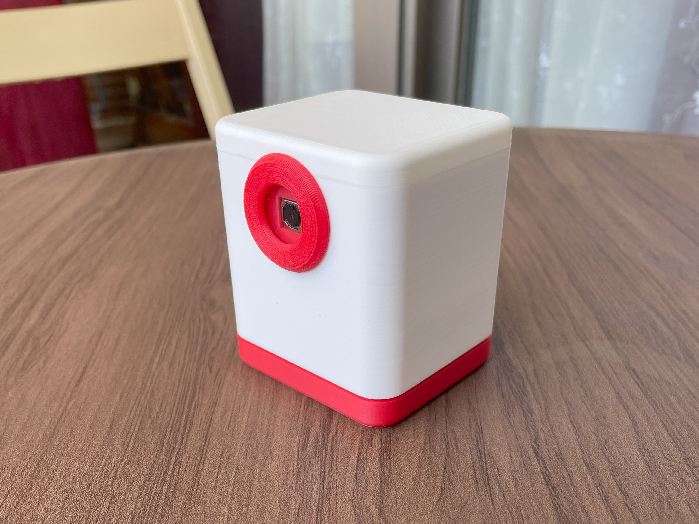
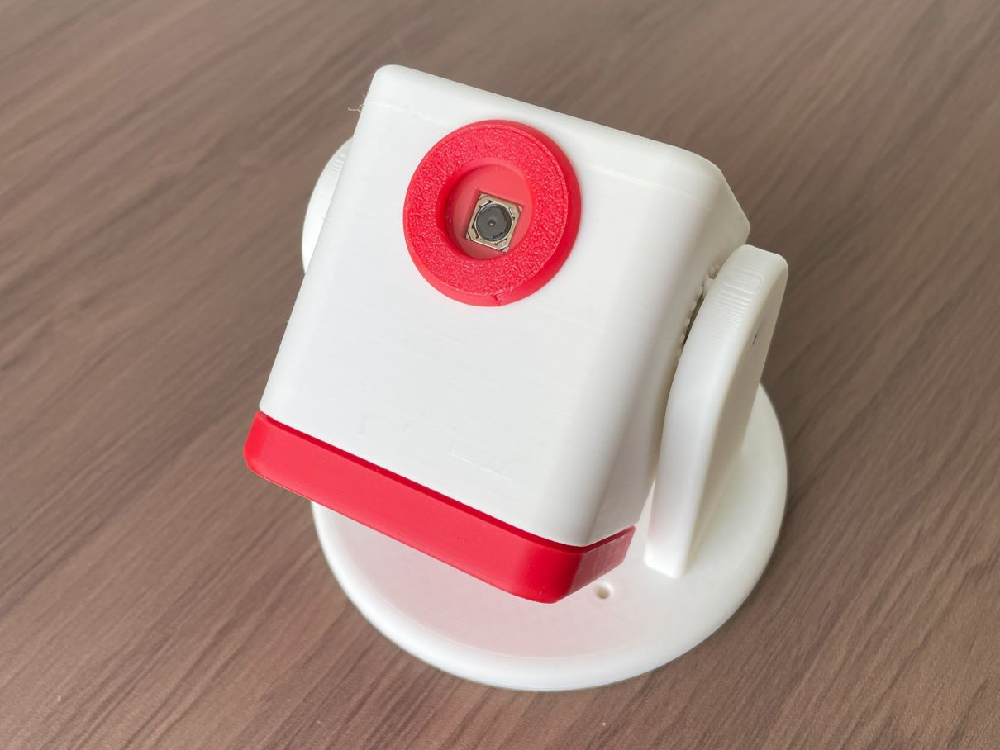
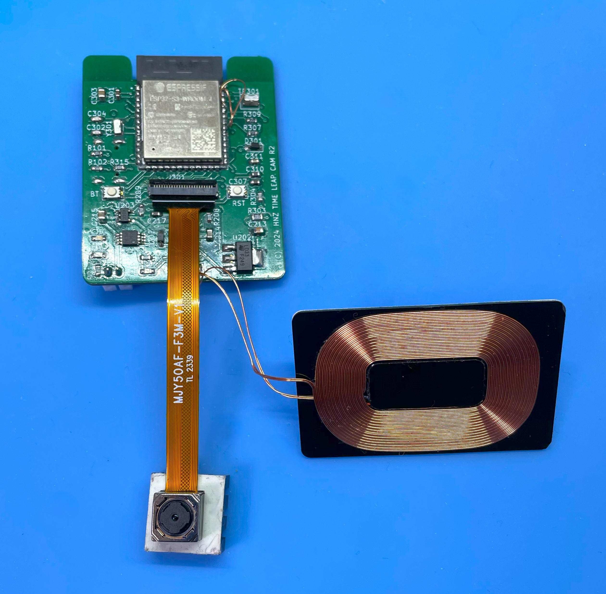
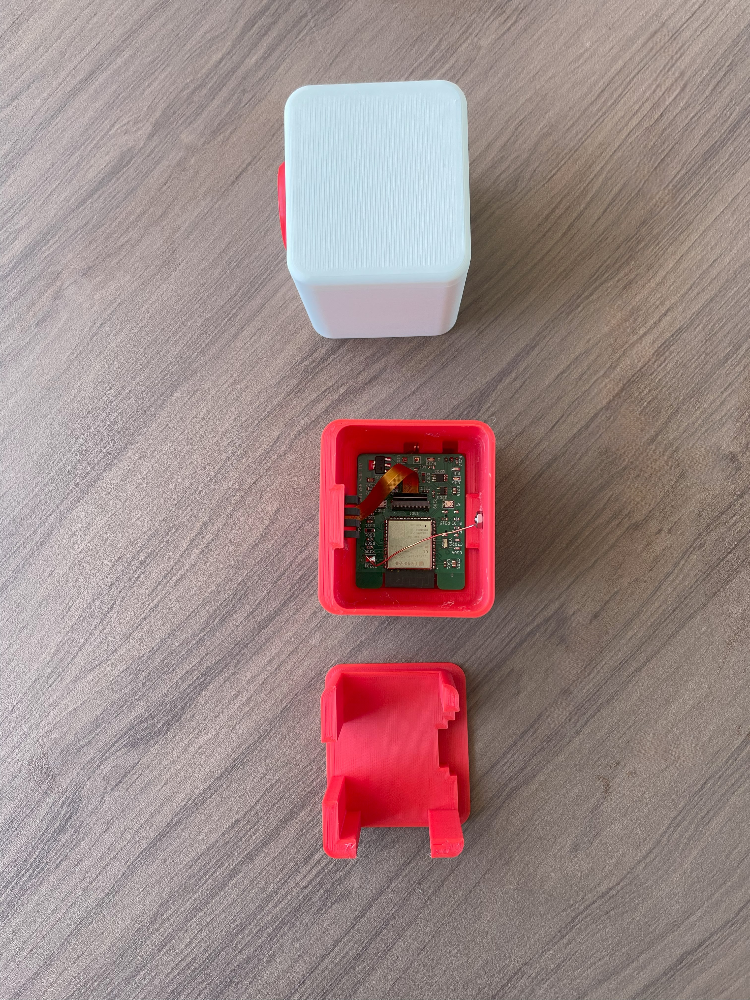
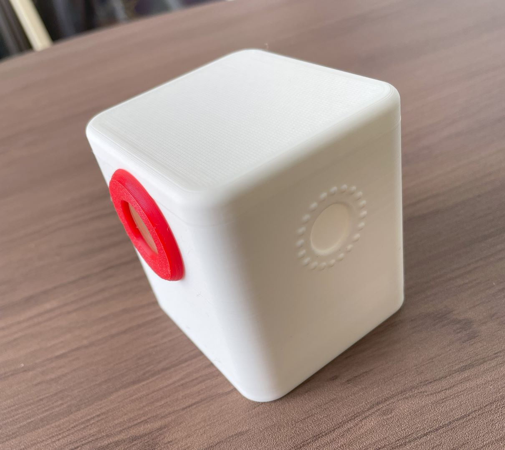
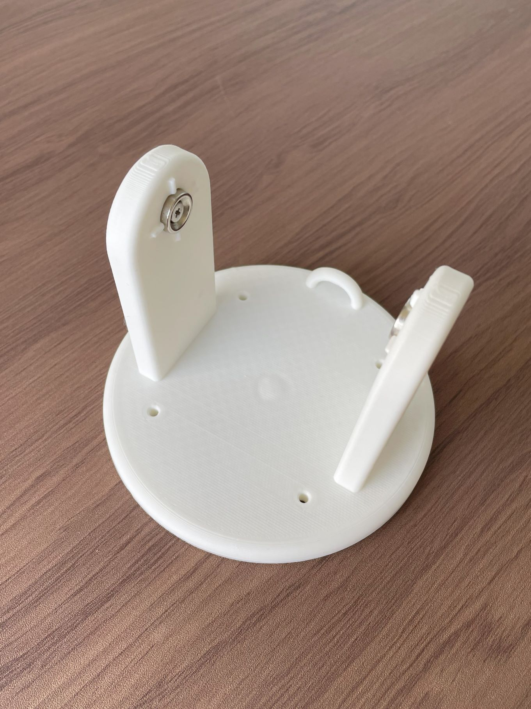

<div align="center">
  <h1><code>Time Leap Cam</code></h1>
  <p>
    
  </p>
</div>

# Time Leap Cam - Super Long Term Time-Lapse Camera and Monitoring by OpenAI

## Overview
The TIME LEAP CAM is an autofocus camera designed for long-duration time-lapse photography. Named for its ability to "leap" through time, this camera is ideal for monitoring over extended periods. It operates on battery power and features a DeepSleep mode to conserve energy when not actively shooting. Images are stored on a 64GB eMMC within one of eleven designated folders.

Update v0.3.1
- Added the movie shooting function. The movie is created by combining the images taken at the specified cycle. 
 Capture Frames At Once (sec): The number of frames to capture at once. The default is 0, which means that the image is captured one by one. If you set it to 1, the image is captured during the 1 sec. If you set image resolution to VGA, the image is captured by 27 fps. HD is 15 - 27 fps. Full HD is 6 fps.
- Capture images are stored by appending the file. If you set to "Over Write Save", the image is overwritten. 
- Added the Open AI model 'GPT-4o mini' selection. The default is 'GPT-4o'. You can select the model from GPT-4o, GPT-4 Turbo, GPT-4o mini.
- If touch the button during 3 secs on the back, the camera starts the movie shooting. The movie shooting is stopped when the button is touched again.
- Improved the writing speed of the eMMC.
- Change the Report Interval: The default is 3600 sec. The report interval is changed to 3600 sec. The status report is sent to LINE when the specified cycle is reached.
- Camera interface is changed. Power Down, Reset pin is removed. In previous version, the power down pin and reset
pin are assigned by dumy GPIO pin. The 'esp-camera-rs' driver must be updated to the latest version.
- Fixed the bug that captured images are broken when the camera is in the DeepSleep mode. v0.3.1 is the stable version.
- Capturing clock is changed to 5MHz or 25MHz. The default is 5MHz when one image captured. When the movie is captured, the clock is changed to 25MHz.
- Changed the number of the frame buffer is 2. v0.3.0 set the number of the frame buffer to 3. But the eMMC writing speed is not enough to write the image to the eMMC. Since the eMMC writing speed is improved, the number of the frame buffer is changed to 2.
- Changed allocate_unit_size to 4096 for the eMMC writing speed at the v0.3.1.
- Fixed the bug that captured images are deleted when the camera is in the DeepSleep mode. v0.3.1 is fixed the bug.

Update v0.2.0
- Updated the UI for the configuration screen.
- Added the function to send a notification as status to LINE when the specified cycle is reached.
- Added the function to check the preview image on the web.
- Added images are uploaded to Cloudflare Images for private storage with signed URL.
- Added images are automatically deleted from the Cloudflare Images after 1 days.
- Added images can be downloaded as a compressed image from this camera on the web. (PC browser only)
- Added the function to check the remaining battery level on the web.
- Added the function to check the WiFi signal level on the web.
- Added the function to limit the time-lapse shooting time.
- Added the function to shoot when the camera touches the button during 3 secs on the back.

New Container Design
- The new container design is added for the camera


## Features
- **Autofocus Capability**: Ensures clear images over long shooting intervals.
- **Energy Efficiency**: Utilizes DeepSleep mode for minimal power consumption (less than 440uA, 1.5mW).
- **Wireless Charging**: Supports Qi wireless charging and automatically stops charging when full.
- **Water Resistance**: Suitable for outdoor use with splash resistance.
- **Advanced Notifications**: Uses OpenAI's GPT-4o/GPT-4o mini for image recognition and sends notifications via LINE when specific conditions are met.
- **Natural Language Configuration**: Set notification conditions in multiple languages through a simple interface.
- **Touch-Activated Web Server**: Access settings via a browser with automatic return to sleep mode after 5 minutes of inactivity.
- **Time Synchronization**: Uses NTP for automatic time adjustment when connected to WiFi, with RTC to maintain time offline.

## Specification
- **Resolution**: Up to 2592x1944 (QSXGA)
- **Sensor**: OV5640 5M pixel sensor
- **SoC Module**: ESP32-S3-WROOM-1-N16R8 (160MHz, 512KB SRAM, 16MB Flash, 8MB PSRAM)
- **Battery**: 3.7V LiPo 1100mAh
- **Storage**: 64GB eMMC
- **Connectivity**: WiFi 2.4GHz
- **Charging**: Qi wireless charging compatible
- **Dimensions**: 78(W) x 79(H) x 68(D) mm Box

## Usage
To use the TIME LEAP CAM, place it on a Qi wireless charger to charge power. Configure the camera settings such as shooting interval, time, and resolution through a web browser connected via WiFi. The camera can be activated from sleep mode by touching the screw on the back, which launches the web server for configuration.

## Options
- **Folder Selection**: Choose from 11 different folders for storing images.
- **Image Resolution**: Selectable up to QSXGA (2592x1944).
- **Notification Conditions**: Set via natural language input on the configuration screen.

## Notes
- **Water Immersion**: The camera is not designed to withstand full submersion in water.
- **API Keys Required**: To use the image recognition and notification features, obtain API keys from OpenAI, CloudFlare Images, and LINE Messaging API.
- **Internet Connection**: Required for using advanced features like image recognition and notifications. Time-lapse functionality is available without WiFi.

For API keys and more information, visit:
- OpenAI API: [https://openai.com/index/openai-api/](https://openai.com/index/openai-api/)
- CloudFlare Images: [https://developers.cloudflare.com/images/about](https://developers.cloudflare.com/images/about)
- LINE Messaging API: [https://developers.line.biz/en/docs/messaging-api/](https://developers.line.biz/en/docs/messaging-api/)
# How to build from code and Install to the unit.

Using Ubuntu 22.04.3 LTS and ESP-IDF V5.2.1

## Prerequisites
Before proceeding with the installation, ensure that your system meets the following requirements:
- Operating System: Linux-based distribution
- Required Packages: git, python3, python3-pip, gcc, build-essential, curl, pkg-config, libudev-dev, libtinfo5, clang, libclang-dev, llvm-dev, udev, libssl-dev, python3.10-venv

## Installation Steps

### 1. System Update and Package Installation
Update your system and install the necessary packages using:
```bash
sudo apt update && sudo apt -y install git python3 python3-pip gcc build-essential curl pkg-config libudev-dev libtinfo5 clang libclang-dev llvm-dev udev libssl-dev python3.10-venv
```

### 2. Rust Installation
Install Rust programming language and Cargo package manager:
```bash
curl --proto '=https' --tlsv1.2 -sSf https://sh.rustup.rs | sh
```
After installation, activate Rust by sourcing the environment:
```bash
. "$HOME/.cargo/env"
```

### 3. Additional Tools Installation
Install the following Rust tools:
- ldproxy
- espup
- cargo-espflash

Use the following commands:
```bash
cargo install ldproxy
cargo install espup
cargo install cargo-espflash
```
2024-08-12, cargo-espflash can not be compiled.
If you have an error, use the following command.
```bash
cargo install cargo-binstall
cargo binstall cargo-espflash 
```

### 4. ESP Environment Setup
Run the following command to install and update the Espressif Rust ecosystem:
```bash
espup install
espup update
```
Set up environment variables:
```bash
. ./export-esp.sh
```

### 5. Udev Rules Configuration
Configure udev rules for device permissions:
```bash
sudo sh -c 'echo "SUBSYSTEMS==\"usb\", ATTRS{idVendor}==\"303a\", ATTRS{idProduct}==\"1001\", MODE=\"0666\"" > /etc/udev/rules.d/99-esp32.rules'
sudo udevadm control --reload-rules
sudo udevadm trigger
```

### 6. Clone Repository
Clone the TimeLeapCam repository:
```bash
git clone https://github.com/hnz1102/timeleapcam.git
cd timeleapcam/code/
```

### 7. Setting WiFi SSID, Password, etc.
Change the following the configuration file.
```bash
cfg.toml

[timeleapcam]
wifi_ssid = "<Your AP SSID>"  # Set your AP SSID
wifi_psk = "<Your AP Password>" # Set your AP Password
http_server = "" # NOT USED
resolution = "8"
track_id = "0"
timezone_offset = "9"
auto_capture = "false"
idle_in_sleep_time = "300"
duration = "0"
api_key = "<API KEY for openAI>" # Set your OpenAI API Key
model = "gpt-4o"
query_openai = "false"
query_prompt = "If heavy rain is expected in 30 minutes, please include a 'NOTICE' with the reason in your reply. If not, simply respond with 'NONE'. Heavy rain is defined as 30mm/h or more."
post_account = "<Your LINE Account ID>" # Set your LINE Account ID
post_access_token = "<Access Token for LINE Message>" # Set your LINE Access Token
storage_account = "<Your Cloudflare Account ID>" # Set your Cloudflare Account ID
storage_access_token = "<Your Cloudflare Access Token>" # Set your Cloudflare Access Token
storage_signed_key = "<Your Cloudflare Image Signed Key>" # Set your Cloudflare Image Signed Key
post_message_trigger = "NOTICE"
autofocus_once = "true"
status_report = "false"
status_report_interval = "3600"
post_interval = "3600"
leap_day = "-1"
leap_hour = "-1"
leap_minute = "-1"
capture_frames_at_once = "0"
overwrite_saved = "false"
```

### 8. Build and Flash
Build the project and flash it to your device:
```bash
cargo build --release
cargo espflash flash --release --monitor
```
At the first boot, the device will format the eMMC and create the necessary folders. This process may take a few minutes.

## Schematic, PCB Gabar and Container 3D Data

There is a Schematic data in the hardware directory including 3D printing data. 





### New Cover and Base for the Camera


Base for the camera is also available for 3D printing. base-v14.stl is the latest version.


## Troubleshooting
- **Permission Issues**: Ensure udev rules are set correctly and you have the necessary permissions to access the device.
- **Build Errors**: Check that all dependencies are installed correctly. If errors persist, try cleaning the project with `cargo clean` and rebuild.

## LICENSE
This source code is licensed under MIT. Other Hardware Schematic documents are licensed under CC-BY-SA V4.0.

This project uses the following libraries and resources:
  
https://github.com/jlocash/esp-camera-rs

https://github.com/0015/ESP32-OV5640-AF

These libraries are licensed under each library's respective licenses.