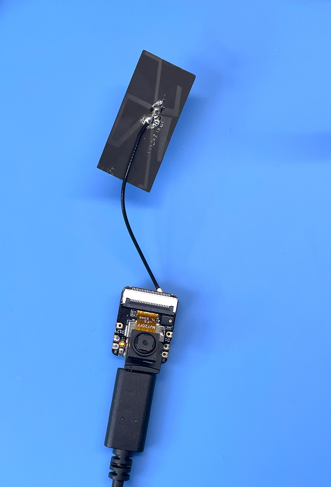

<div align="center">
  <h1><code>Time Leap Cam on XIAO ESP32S3 Sense</code></h1>
  <p>
    
  </p>
</div>

# Time Leap Cam - Super Long Term Time-Lapse Camera and Monitoring by OpenAI

## Overview
The TIME LEAP CAM is a camera designed for long-duration time-lapse photography. Named for its ability to "leap" through time, this camera is ideal for monitoring over extended periods. It operates on battery power and features a DeepSleep mode to conserve energy when not actively shooting. Images are stored on a uSD Card within one of eleven designated folders.
It is based on the XIAO ESP32S3 Sense module and uses the OV2640 camera sensor. The camera supports resolutions up to UXGA (1600x1200) and can capture images at intervals ranging from seconds to hours.

Actually, This software is very similar to the [main](https://github.com/hnz1102/timeleapcam/tree/main) branch. The following are the limitations.
- The resolution is limited to 1600x1200 when you use XIAO ESP32S3 Sense module. If you can use OV5640 camera module, you can use 2592x1944 resolution.
- The camera is not autofocus when you use XIAO ESP32S3 Sense module. If you can use OV5640 camera module, you can use autofocus function.
- Memory storage is limited to 32GB SD card.
- XIAO ESP32S3 Sense module has not Qi wireless charging capability.
- XIAP ESP32S3 Sense module has not XTAL for RTC. So, the time is not accurate without WiFi connection.

### v0.3.0 - 2024-08-17
- Change the SD Card Host Controller to SDSPI from SDMMC. When camera is writing the imege to the SD Card, User LED is blinking. When the LED is off, you can remove the SD Card.
- Add the 'System Temperature' to the status report. The temperature is measured by the internal temperature sensor of ESP32S3.

## Warning
The XIAO ESP32S3 Sense module is getting hot when the camera is working. Please be careful to handle the camera.

# How to build from code and Install to the unit.

Using Ubuntu 22.04.3 LTS and ESP-IDF V5.2.1

## Prerequisites
Before proceeding with the installation, ensure that your system meets the following requirements:
- Operating System: Linux-based distribution
- Required Packages: git, python3, python3-pip, gcc, build-essential, curl, pkg-config, libudev-dev, libtinfo5, clang, libclang-dev, llvm-dev, udev, libssl-dev, python3.10-venv

## Installation Steps

### 1. System Update and Package Installation
Update your system and install the necessary packages using:
```bash
sudo apt update && sudo apt -y install git python3 python3-pip gcc build-essential curl pkg-config libudev-dev libtinfo5 clang libclang-dev llvm-dev udev libssl-dev python3.10-venv
```

### 2. Rust Installation
Install Rust programming language and Cargo package manager:
```bash
curl --proto '=https' --tlsv1.2 -sSf https://sh.rustup.rs | sh
```
After installation, activate Rust by sourcing the environment:
```bash
. "$HOME/.cargo/env"
```

### 3. Additional Tools Installation
Install the following Rust tools:
- ldproxy
- espup
- cargo-espflash

Use the following commands:
```bash
cargo install ldproxy
cargo install espup
cargo install cargo-espflash
```
2024-08-12, cargo-espflash can not be compiled.
If you have an error, use the following command.
```bash
cargo install cargo-binstall
cargo binstall cargo-espflash 
```

### 4. ESP Environment Setup
Run the following command to install and update the Espressif Rust ecosystem:
```bash
espup install
espup update
```
Set up environment variables:
```bash
. ./export-esp.sh
```

### 5. Udev Rules Configuration
Configure udev rules for device permissions:
```bash
sudo sh -c 'echo "SUBSYSTEMS==\"usb\", ATTRS{idVendor}==\"303a\", ATTRS{idProduct}==\"1001\", MODE=\"0666\"" > /etc/udev/rules.d/99-esp32.rules'
sudo udevadm control --reload-rules
sudo udevadm trigger
```

### 6. Clone Repository
Clone the TimeLeapCam repository with the XIAO-ESP32S3_SENSE branch:
```bash
git clone https://github.com/hnz1102/timeleapcam.git -b XIAO_ESP32S3_SENSE
cd timeleapcam/code/
```

### 7. Setting WiFi SSID, Password, etc.
Change the following the configuration file.
```bash
cfg.toml

[timeleapcam]
wifi_ssid = "<Your AP SSID>"  # Set your AP SSID
wifi_psk = "<Your AP Password>" # Set your AP Password
http_server = "" # NOT USED
resolution = "8"
track_id = "0"
timezone_offset = "9"
auto_capture = "false"
idle_in_sleep_time = "300"
duration = "0"
api_key = "<API KEY for openAI>" # Set your OpenAI API Key
model = "gpt-4o"
query_openai = "false"
query_prompt = "If heavy rain is expected in 30 minutes, please include a 'NOTICE' with the reason in your reply. If not, simply respond with 'NONE'. Heavy rain is defined as 30mm/h or more."
post_account = "<Your LINE Account ID>" # Set your LINE Account ID
post_access_token = "<Access Token for LINE Message>" # Set your LINE Access Token
storage_account = "<Your Cloudflare Account ID>" # Set your Cloudflare Account ID
storage_access_token = "<Your Cloudflare Access Token>" # Set your Cloudflare Access Token
storage_signed_key = "<Your Cloudflare Image Signed Key>" # Set your Cloudflare Image Signed Key
post_message_trigger = "NOTICE"
autofocus_once = "true"
status_report = "false"
status_report_interval = "3600"
post_interval = "3600"
leap_day = "-1"
leap_hour = "-1"
leap_minute = "-1"
capture_frames_at_once = "0"
overwrite_saved = "false"
```

### 8. Build and Flash
Build the project and flash it to your device:
```bash
cargo build --release
cargo espflash flash --release --monitor
```
At the first boot, You should push 'boot' button and 'Reset' button when you connect the USB. ESP32S3 Sense module will download mode. After that, you can flash the firmware.
uSD card should be inserted before you boot the device. At the first boot, the device will format the SD Card and create the necessary folders. This process may take a few minutes.

## LICENSE
This source code is licensed under MIT. See LICENSE for more information.

This project uses the following libraries and resources:
  
https://github.com/jlocash/esp-camera-rs

https://github.com/0015/ESP32-OV5640-AF

These libraries are licensed under each library's respective licenses.
